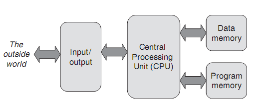
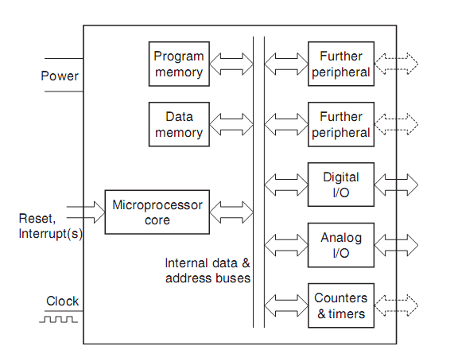
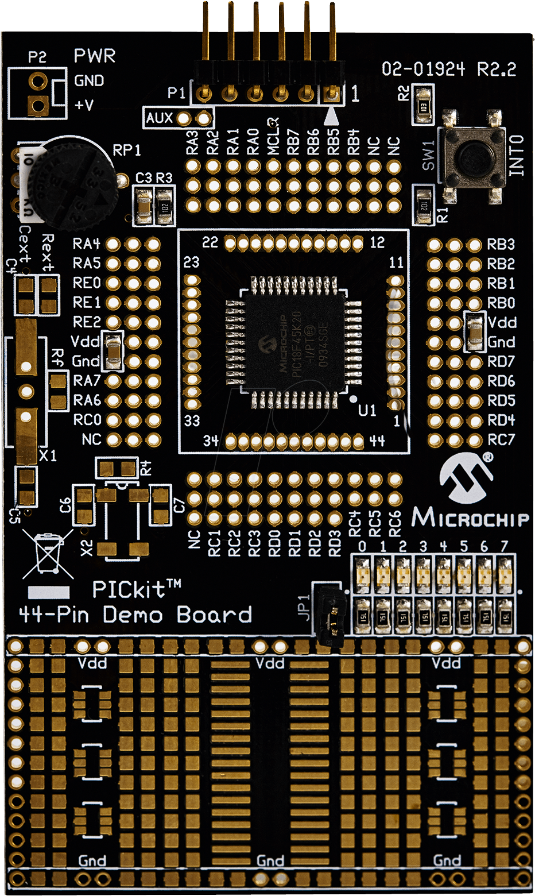
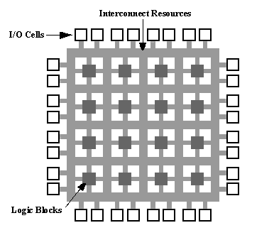
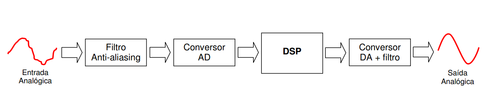

# ENGC50

### Sistemas Microprocessados

### 2017.1

#HSLIDE

#### Sistemas embarcados

- Microprocessadores de propósito geral
- Microcontroladores
- FPGA
- DSP (Digital Signal Processor)

#HSLIDE

#### Microprocessadores de propósito geral

- Microprocessadores são dispositivos digitais programáveis que integram todas as funcionalidades de uma CPU em um único chip.
- Possuem conjunto de instruções e arquitetura bem definidos
- Não possuem dispositivos de I/O integrados
- Não possuem timers, contadores, ou interfaceamento com sinais analógicos
- São usados em aplicações genéricas
- x86, PowerPC, Z80

#HSLIDE

#### Microprocessadores de propósito geral

#HSLIDE

#### Microcontroladores

- Um microcontrolador pode ser definido como um sistema computacional totalmente contido em um circuito integrado
- Conjunto de instruções e arquitetura definidas
- Possuem recursos de I/O
- Custo e consumo baixos
- Poder de processamento menor que um microprocessador de propósito geral
- 8051, PIC, ATmega8

#HSLIDE

#### Microcontroladores

 

#HSLIDE

#### Microcontroladores

<!-- -->

#HSLIDE

#### FPGA – Field Programmable Gate Array

- Um FPGA é um dispositivo digital contendo blocos lógicos e conexões programáveis
- Não possui arquitetura definida
- Geralmente não possuem facilidades de I/O
- Usada em aplicações computacionais que demandam processamento paralelo reconfigurável
- Possui recursos de memória interna

#HSLIDE

#### FPGA – Field Programmable Gate Array

 

#HSLIDE

#### DSP (Digital Signal Processor)

- Hardware especializado para execução eficiente de operações matemáticas comuns  (adição, multiplicação) e transferência de memória 
- Alta velocidade de operação, possibilitando a amostragem e manipulação de grandes quantidades de dados 
- Componentes arquiteturais específicos com o objetivo de aumentar a eficiência do processamento de sinais
- Conjunto de instruções definido
- Possui alto grau de paralelismo

#HSLIDE

#### DSP (Digital Signal Processor)

 

#HSLIDE

